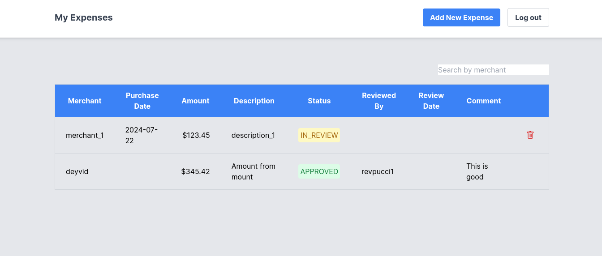

# Gerenciamento de Despesas - Expenses Web
Projeto didático da bibliografia usando Spring e Next/React com Tailwind CSS

Este projeto é uma aplicação que ajuda empresas a gerenciar as despesas de seus funcionários. Funciona como um site onde os funcionários podem registrar suas despesas, como viagens ou compras de trabalho. Os supervisores podem ver essas despesas e decidir se devem ser aprovadas ou não.

Para garantir que cada pessoa tenha acesso correto às informações, o sistema define diferentes permissões. Por exemplo, os supervisores podem ver todas as despesas dos funcionários, enquanto os próprios funcionários só podem ver as suas.

## Permissões do Projeto
| Função             | Endpoint                          | Permissão                  | Descrição                                                      |
|--------------------|-----------------------------------|----------------------------|----------------------------------------------------------------|
| Revisores          | GET /employees                    | Leitura de funcionários    | Obtém a lista de todos os funcionários.                         |
| Revisores          | PUT /expenses/{expense_id}/status | Atualização de despesas    | Atualiza o status de uma despesa específica.                   |
| Dado o ID do Funcionário | GET /employees/{employee_id}/expenses | Leitura de despesas       | Obtém a lista de despesas de um funcionário específico.        |
| Dado o ID do Funcionário | POST /employees/{employee_id}/expenses | Criação de despesas       | Cria uma nova despesa para um funcionário específico.          |
| Dado o ID do Funcionário | DELETE /employees/{employee_id}/expenses | Exclusão de despesas    | Exclui todas as despesas de um funcionário específico.         |

Essa tabela resume os endpoints disponíveis para revisores e funcionários, detalhando suas permissões e operações permitidas em relação às despesas e funcionários.

## Técnologias usadas
* Spring Boot 3.3.2 (API)
  * Spring Starter Web
  * Spring Starter Data JPA
  * Spring Starter Security
  * PostgreSQL Connector
* Next.js React (UI)
  * React.js 18
  * Postcss 8
  * Tailwind CSS 3
  * TypeScript 5
  * Headless UI

## Contribuição

Contribuições são bem-vindas! Sinta-se à vontade para abrir uma issue ou enviar um pull request com melhorias.